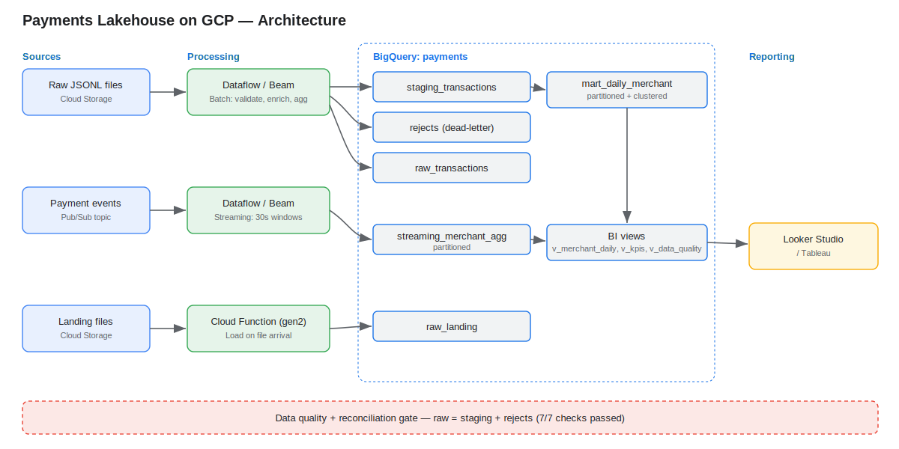

# Payments Lakehouse on GCP

An end-to-end **fintech payments data platform** on Google Cloud, demonstrating
batch, streaming, and event-driven ingestion into BigQuery with data-quality
gating and a BI layer. Built with Apache Beam (Dataflow), Pub/Sub, Cloud Storage,
Cloud Functions, and BigQuery.

## Architecture



Three ingestion paths (batch, streaming, event-driven) feed a layered BigQuery
warehouse (raw → staging → marts → BI views), gated by data-quality and
reconciliation checks. Full write-up in [docs/PROJECT_REPORT.md](docs/PROJECT_REPORT.md)
([PDF](docs/PROJECT_REPORT.pdf)).

## GCP services used
| Service | Role |
|---|---|
| **Dataflow / Apache Beam** | Batch + streaming transformation pipelines |
| **Pub/Sub** | Event streaming backbone |
| **BigQuery** | Warehouse: raw → staging → partitioned/clustered marts → BI views |
| **Cloud Storage** | Data lake + landing zone |
| **Cloud Functions (gen2)** | Event-driven, file-arrival ingestion |
| **IAM** | Least-privilege service accounts |

## Repo layout
```
pipelines/
  batch_transactions.py       # Beam batch: parse, validate, enrich, aggregate, dead-letter
  streaming_transactions.py   # Beam streaming: Pub/Sub -> windowed agg -> BigQuery
data/
  generate_transactions.py    # synthetic data (with intentional bad records)
  publish_events.py           # publishes live events to Pub/Sub
sql/
  mart_daily_merchant.sql     # partitioned + clustered gold mart
  bi_views.sql                # v_merchant_daily, v_kpis, v_data_quality
dq/
  run_checks.py               # 7 data-quality + reconciliation checks (non-zero exit on fail)
cloud_function/
  main.py                     # GCS finalize -> load to BigQuery
docs/
  architecture.svg            # architecture diagram
  PROJECT_REPORT.md / .pdf    # implementation report with results
  dashboard.md                # Looker Studio / Tableau setup
```

## Quickstart (local)
```bash
python3 -m venv .venv && source .venv/bin/activate
pip install -r requirements.txt

# 1) Generate data and run the batch pipeline locally (DirectRunner)
cd data && python generate_transactions.py --count 1000 --out raw_transactions.jsonl && cd ..
cd pipelines && python batch_transactions.py \
  --input ../data/raw_transactions.jsonl --output_dir ../data/out
```

## Run on GCP
```bash
PROJECT=<your-project>

# Streaming: Pub/Sub -> Beam -> BigQuery
python pipelines/streaming_transactions.py --project $PROJECT \
  --subscription projects/$PROJECT/subscriptions/payment-events-sub \
  --output_table $PROJECT:payments.streaming_merchant_agg \
  --temp_location gs://$PROJECT-payments-lake/tmp
python data/publish_events.py --project $PROJECT --count 400 --rate 80

# Data quality gate
GOOGLE_CLOUD_PROJECT=$PROJECT python dq/run_checks.py
```

## Results (1,000 input records)
| Layer | Rows |
|---|---|
| raw_transactions | 1,000 |
| staging_transactions (valid) | 935 |
| rejects (dead-letter) | 65 |
| mart_daily_merchant | 53 |
| streaming_merchant_agg | 14 |
| raw_landing (Cloud Function) | 50 |

Dead-letter rate 6.5%; data-quality checks 7/7 passed, including reconciliation
`raw (1000) = staging (935) + rejects (65)`.

## Key design decisions
- **Dead-letter over drop:** invalid records are routed to a `rejects` sink with an
  error reason, so one bad record never fails the job and nothing is silently lost.
- **Partition + cluster:** mart is partitioned by `txn_date` and clustered by
  `merchant` to minimize bytes scanned (cost) and speed up filters/aggregations.
- **BI reads views, not tables:** dashboards depend on `v_*` views so the storage
  layer can change without breaking reporting.
- **Quality as a gate:** `run_checks.py` exits non-zero on failure so an orchestrator
  (e.g. Airflow) can halt the pipeline.
