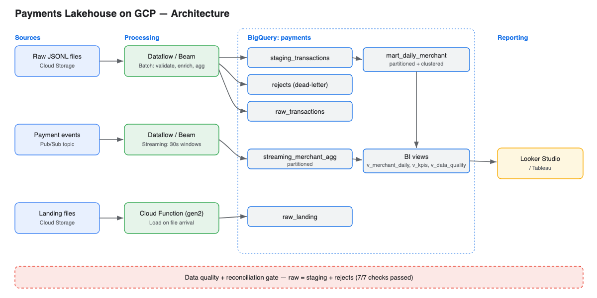

# Project Report — Payments Lakehouse on GCP

## 1. Overview
This project implements a payments data platform on Google Cloud that ingests
transaction data through three paths — batch, streaming, and event-driven — and
serves modeled data for analytics. The goal is a production-shaped reference
implementation covering ingestion, transformation, warehouse modeling, data
quality, and a BI layer.

## 2. Architecture

The platform has three ingestion paths feeding a layered BigQuery warehouse
(raw → staging → marts → BI views), with a data-quality gate validating the result.

| Path | Trigger | Component | Destination |
|------|---------|-----------|-------------|
| Batch | Scheduled / manual run | Apache Beam (DirectRunner / Dataflow) | staging, marts, rejects |
| Streaming | Continuous | Apache Beam streaming + Pub/Sub | streaming_merchant_agg |
| Event-driven | File upload to GCS | Cloud Function (gen2) | raw_landing |

## 3. Components

### 3.1 Batch pipeline (`pipelines/batch_transactions.py`)
Reads newline-delimited JSON, validates each record, and writes cleaned records
to staging, per-merchant totals to a mart, and invalid records to a dead-letter
output. Validation uses tagged outputs so a malformed record is routed aside
rather than dropped or failing the job.

### 3.2 Streaming pipeline (`pipelines/streaming_transactions.py`)
Consumes events from Pub/Sub, validates them, and aggregates count and total
amount per merchant over fixed 30-second windows, appending results to BigQuery.

### 3.3 Event-driven ingestion (`cloud_function/main.py`)
A Cloud Function triggered on object finalize in the landing bucket loads new
JSONL files into BigQuery automatically.

### 3.4 Warehouse modeling (`sql/`)
The gold mart `mart_daily_merchant` is partitioned by `txn_date` and clustered by
`merchant` to minimize bytes scanned and speed up filters and aggregations. BI
views expose curated, stable interfaces for reporting tools.

### 3.5 Data quality (`dq/run_checks.py`)
Seven checks cover volume, null keys, value validity, uniqueness, raw-to-output
reconciliation, and dead-letter rate. The process exits non-zero on any failure
so it can gate an orchestrated pipeline.

## 4. Results

### Ingestion / validation (1,000 input records)
| Layer | Rows |
|-------|------|
| raw_transactions | 1,000 |
| staging_transactions (valid) | 935 |
| rejects (dead-letter) | 65 |
| mart_daily_merchant | 53 |
| streaming_merchant_agg | 14 |
| raw_landing (via Cloud Function) | 50 |

Dead-letter rate: **6.5%** (within the 10% threshold).

### Data quality
All **7/7** checks passed, including reconciliation: `raw (1000) = staging (935) + rejects (65)`.

## 5. Design decisions
- **Dead-letter over drop** — invalid records are preserved with an error reason,
  protecting both job stability and data completeness.
- **Partitioning + clustering** — chosen on the columns most used for filtering
  (`txn_date`) and grouping (`merchant`) to control query cost and latency.
- **Views for BI** — reporting depends on views, decoupling dashboards from the
  physical table layout.
- **Quality as a gate** — checks return a non-zero exit code so an orchestrator
  can stop downstream processing on failure.

## 6. Technology
Apache Beam / Dataflow, Pub/Sub, BigQuery, Cloud Storage, Cloud Functions (gen2),
IAM, Python, SQL.
